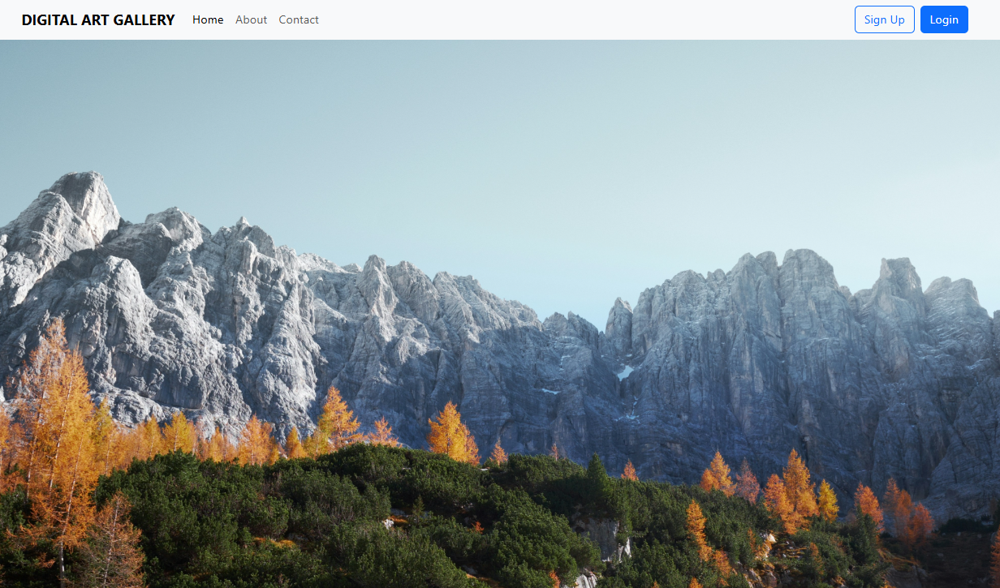
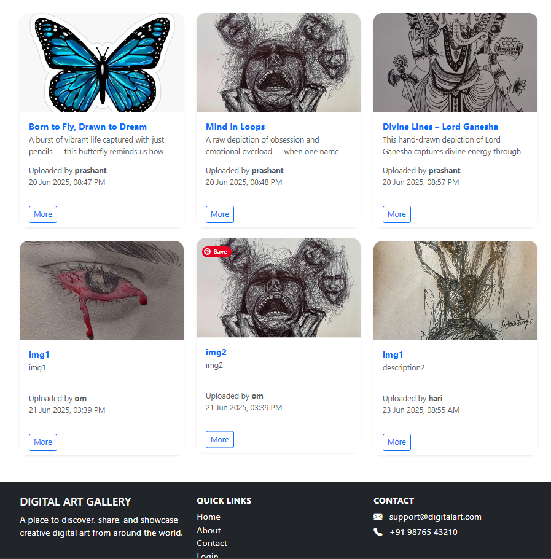
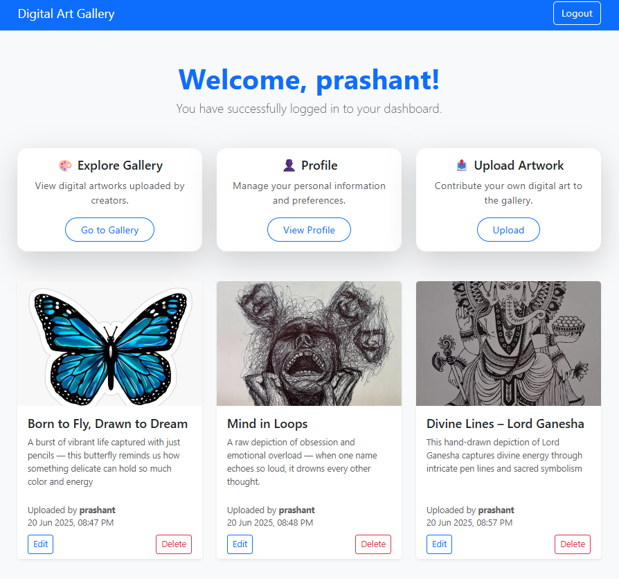

# 🎨 Digital Art Gallery

A full-stack web application to **showcase, upload, like, and explore digital artwork**. Built using **PHP**, **MySQL**, **Bootstrap**, and **JavaScript**, this platform allows users to share their creativity and connect with others in the digital art space.

---

## 🖼️ Features

- ✅ **User registration and login**
- 🖌️ **Upload artworks** with title and description
- 🔐 **Session-based dashboard access**
- 📅 **Timestamped artwork uploads**
- 📷 **Responsive gallery** with image previews using Bootstrap cards
- 📁 **MySQL stored procedures** for efficient data operations
- 🧩 **MySQL trigger** logs every artwork upload
- ✔️ **Form validation** to ensure clean and secure data entry

---

## 🛠️ Tech Stack

| Layer    | Tech Used                   |
| -------- | --------------------------- |
| Frontend | HTML, CSS (Bootstrap 5), JS |
| Backend  | PHP (Core PHP)              |
| Database | MySQL (phpMyAdmin)          |
| UI/UX    | Bootstrap Cards & Icons     |
| Hosting  | XAMPP / Localhost           |

---

## 📁 SQL Procedures Used

- addUpload – Inserts new artwork into the gallery.
- editupload – Updates existing artwork details (title, description, image).
- deleteArt – Deletes a specific artwork by ID and user ID.
- signUser – Registers a new user account.
- profileUser – Updates user profile (fullname, email, username).
- forgotPassword – Resets user password using the username.

---

## 🚀 Setup Instructions

1. **Clone the repository**
   ```bash
   git clone https://github.com/prashantvhkm/digital-art-galley.git
   ```
2. **Start XAMPP Server**

   - Start Apache and MySQL from the XAMPP control panel.
   - Place the cloned project folder inside the htdocs directory.

3. **Import the SQL database.**

   - Open `http://localhost/phpmyadmin`
   - Create a new database (e.g. digital_art).
   - Import the provided db.sql file into that database.

4. **Configure the database connection**

   - Open the db.php file.
   - Update it with your MySQL database name, username, and password.

5. **Run the project**
   - Open your browser and go to:

```bash
   http://localhost/PHP_SDAC/29_php/project/digital-art-gallery/index.php
```

## 📸 Screenshots





## 🙌 Credits

Created by **Prashant Vishwakarma**  
📧 [prashantvhkm@gmail.com](mailto:prashantvhkm@gmail.com)  
🔗 [GitHub Profile](https://github.com/prashantvhkm)
